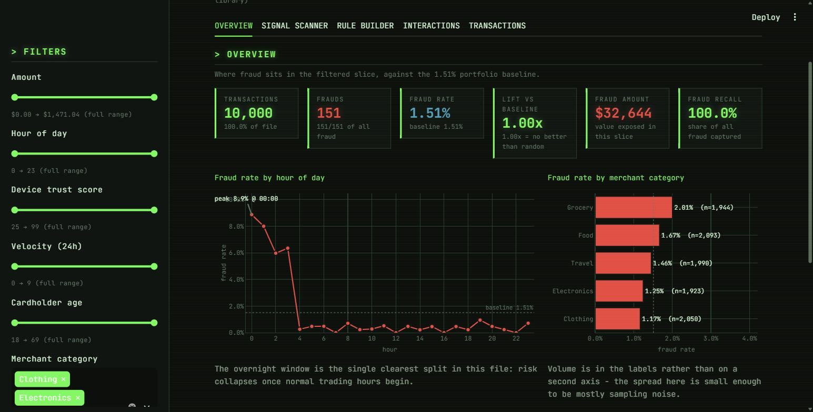
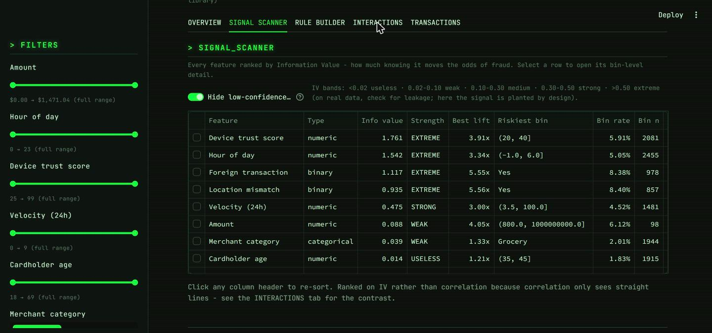
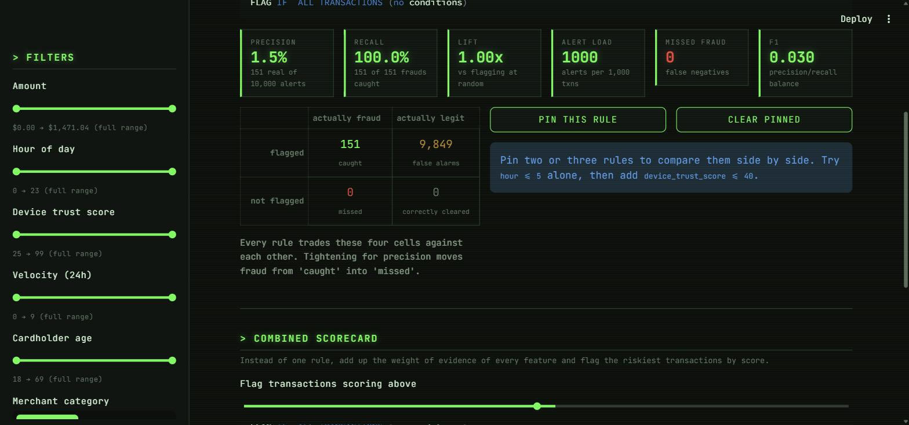
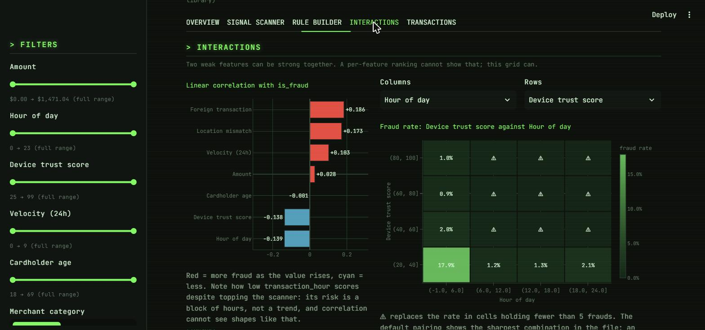
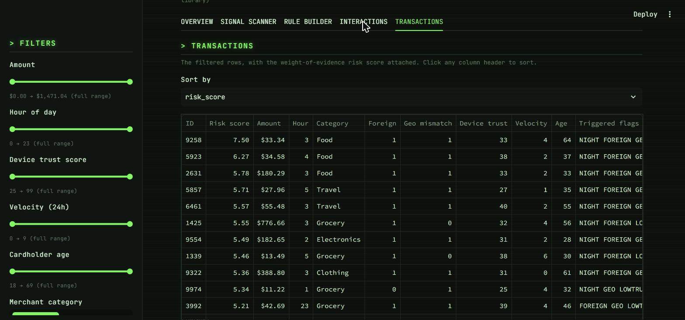

# Fraud Signal Console

An interactive Streamlit dashboard for finding the transaction characteristics that
predict credit-card fraud, styled as a hacker terminal.

The dataset is `credit_card_fraud_10k.csv` — 10,000 transactions, 9 features, and
**151 confirmed frauds (a 1.51% base rate)**. The whole point of the app is to let
you filter and sort your way to the answer to one question: *which characteristics
actually separate fraud from everything else, and which only look like they do?*

The analytics engine is pure statistics — pandas and NumPy, no model library. Every
number on screen traces back to arithmetic over a contingency table.

---

## What it found

Ranked by Information Value, the eight features split cleanly into signal and noise:

| Feature | Info value | Strength | Riskiest bin | Bin fraud rate | Lift |
|---|---|---|---|---|---|
| Device trust score | 1.761 | EXTREME | 20–40 | 5.91% | 3.91× |
| Hour of day | 1.542 | EXTREME | 00:00–06:00 | 5.05% | 3.34× |
| Foreign transaction | 1.117 | EXTREME | Yes | 8.38% | 5.55× |
| Location mismatch | 0.935 | EXTREME | Yes | 8.40% | 5.56× |
| Velocity (24h) | 0.475 | STRONG | 4+ | 4.52% | 3.00× |
| Amount | 0.088 | WEAK | > $800 | 6.12% | 4.05× |
| Merchant category | 0.039 | WEAK | Grocery | 2.01% | 1.33× |
| **Cardholder age** | **0.014** | **USELESS** | 35–45 | 1.83% | 1.21× |

Two results are worth stating plainly:

- **Cardholder age carries no signal at all.** Fraud victims average 43.40 years old,
  everyone else 43.47. Any age pattern you think you see is sampling noise.
- **The strongest predictor is an interaction, not a feature.** Low device trust
  (20–40) *during* the overnight window (00:00–06:00) runs at **17.9% fraud — roughly
  12× the baseline**. Neither condition alone comes close to that.

Note the scanner ranks on Information Value rather than correlation on purpose.
`transaction_hour` has a linear correlation of only −0.139 with the label, which
would bury it in a correlation ranking — its risk is a *block* of hours, not a
trend, and correlation cannot see shapes like that.

---

## The five views

### Overview
Where fraud sits in the current slice, against the 1.51% baseline.



### Signal Scanner
Every feature ranked by Information Value, with the riskiest bin and its lift.
Selecting a row opens bin-level detail: fraud rate per bin with 95% Wilson
confidence intervals, and the weight-of-evidence curve.



### Rule Builder
Reads the sidebar filter as a detection rule and scores it as a classifier —
precision, recall, lift, alert load, and a confusion matrix. Rules can be pinned and
compared side by side. Below it, a combined WoE scorecard flags transactions by
score rather than by a single rule.



### Interactions
Linear correlation against the label, plus a two-feature grid showing the fraud rate
in every cell — this is where the 17.9% combination shows up.



### Transactions
The filtered rows with the risk score and triggered flags attached, sortable on any
column, downloadable as CSV.



---

## Statistical method

- **Lift** — a bin's fraud rate divided by the overall rate. 1.0× means the bin is no
  more interesting than flagging at random.
- **Weight of Evidence** — `ln(P(bin | fraud) / P(bin | legit))`, with a Haldane 0.5
  correction so an empty bin cannot produce `log(0)`. Positive means riskier than
  average.
- **Information Value** — `Σ (P(bin|fraud) − P(bin|legit)) × WoE`. Bands: `<0.02`
  useless, `0.02–0.10` weak, `0.10–0.30` medium, `0.30–0.50` strong, `>0.50` extreme.
- **Wilson score intervals** on every bin rate, rather than the normal
  approximation, because fraud rates sit near zero where the normal interval runs
  below 0 and understates uncertainty.

### On reading these numbers honestly

**Sample size.** There are only 151 frauds. A bin holding three of them produces a
spectacular-looking lift that is pure noise, so any bin below 5 frauds is marked ⚠,
drawn in amber, and excluded from the Information Value total by default. The ⚠ is
in the label text, not just the color, so the warning survives in greyscale.

**IV above 0.5.** On a real portfolio that usually means target leakage and is worth
investigating rather than celebrating. This file is synthetic with signal planted
deliberately, so four features land there honestly — hence the label `EXTREME`
rather than the textbook `suspicious`.

**The scorecard is a ranking, not a probability.** Adding WoE across features assumes
they are independent given the outcome. `foreign_transaction` and
`location_mismatch` clearly are not — they fire together.

---

## Running it

```bash
pip install -r requirements.txt
streamlit run app.py
```

Verified on Python 3.14 with Streamlit 1.63, Plotly 7.0 and pandas 3.0.

## Layout

```
app.py                      Streamlit entrypoint: sidebar filters and the five tabs
src/theme.py                color tokens, terminal CSS, shared Plotly styling
src/data.py                 cached loading, the feature registry, the filter function
src/analytics.py            binning, lift, WoE/IV, Wilson intervals, rule scoring
credit_card_fraud_10k.csv   the dataset
```

`src/data.py` holds a `FEATURES` registry that drives the sidebar, the scanner, the
interaction grid and the scorecard, so a new column is described in exactly one place.

## Design notes

The palette is not decorative. Chart series use red / cyan / violet, validated for
colorblind separation against the `#0F1512` chart surface (CVD ΔE ≥ 11.8 on all
pairs). Neon green is deliberately reserved for interface chrome and never used as a
data series — green and red sit only 3.4 ΔE apart under deuteranopia, so a
green-vs-red chart would be unreadable for a red-green colorblind viewer. Fraud
carries a hatch pattern as well as its color, no chart uses two y-axes, and low-
confidence marks are flagged in text as well as in amber.
